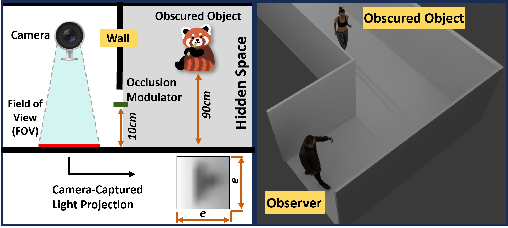
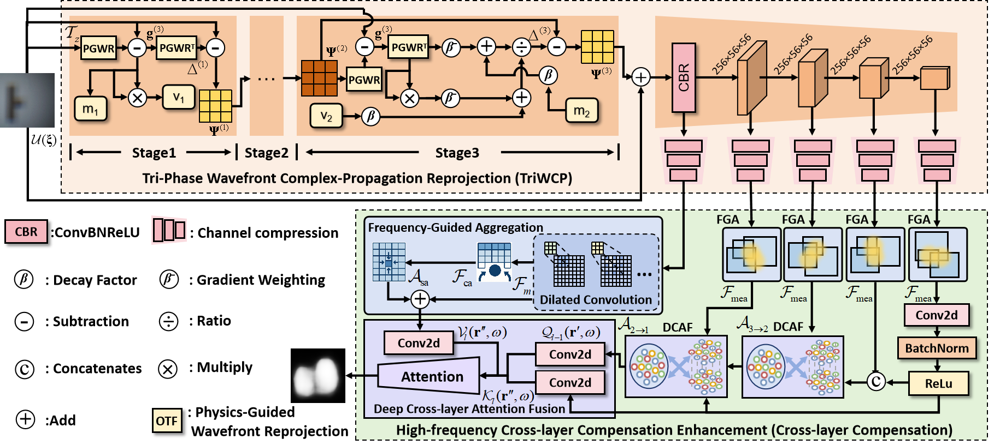
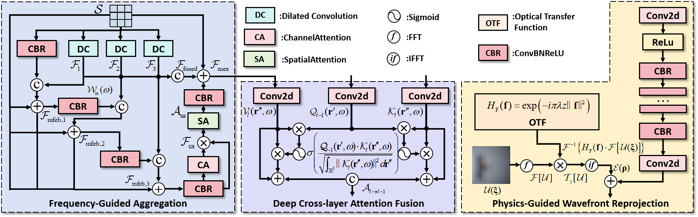
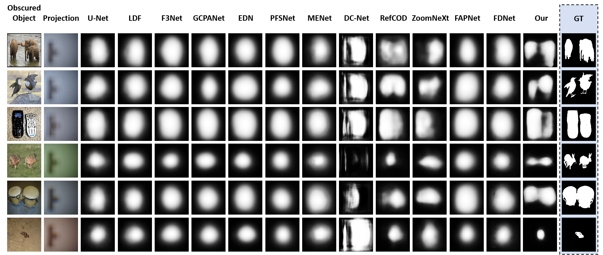

# WavePCNet


## 📂 What’s Available

| Component                        | Status         |
|----------------------------------|----------------|
| 🧠 Model Definition              | ✅ Available   |
| 🏋️‍♀️ Training Code                 | ⏳ Coming Soon  |
| 🧪 Inference Code                | ✅ Available   |
| 🎯 Model Weights                 | ⏳ Coming Soon  |
| 📊 Dataset                       | ⏳ Coming Soon  |
---

## 📄 Paper Information

- **Title**: Wavefront-Constrained Passive Obscured Object Detection
- **Status**: Under Review at [AAAI 2026]

---

## Model Weights and Datasets
**Training Code**, **Model Weights** and **Datasets** will be made public after the paper is accepted. (*Coming Soon!!!*)

## Abstract
Accurately localizing and segmenting occluded objects from faint light patterns beyond the field of view is highly challenging due to multiple scattering and medium-induced perturbations. Most existing methods, based on real-valued modeling or local convolutional operations, are inadequate for capturing the underlying physics of coherent light propagation. Moreover, under low signal-to-noise conditions, these methods often converge to non-physical solutions, severely compromising the stability and reliability of the observation. To address these challenges, we propose a novel physics-driven Wavefront Propagating Compensation Network (WavePCNet) to simulates wavefront propagation and enhance the perception of occluded objects. This WavePCNet integrates the Tri-Phase Wavefront Complex-Propagation Reprojection (TriWCP) to incorporate complex amplitude transfer operators to precisely constrain coherent propagation behavior, along with a momentum memory mechanism to effectively suppress the accumulation of perturbations. Additionally, a High-frequency Cross-layer Compensation Enhancement is introduced to construct frequency-selective pathways with multi-scale receptive fields and dynamically models structural consistency across layers, further boosting the model’s robustness and interpretability under complex environmental conditions. Extensive experiments conducted on four physically collected datasets demonstrate that WavePCNet consistently outperforms state-of-the-art methods across both accuracy and robustness. All data and code will be publicly released to support and encourage continued research in the obscured object detection domain.



## Architecture of WavePCNet


## Architectural composition of the proposed modules


## Result


---

## Test
```
python3 {test_script} {model} \
    --gpus={gpus} \
    --weight={weight_path} \
    --val={valset} \
    --save
```
